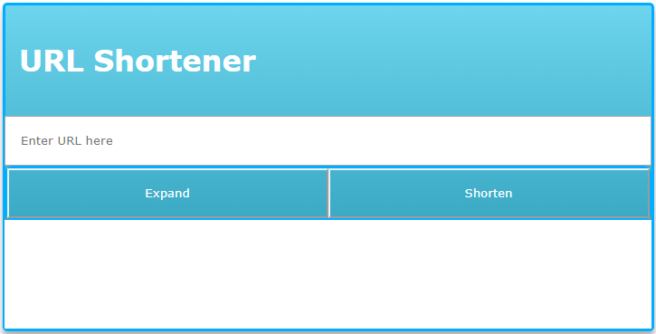

# LILER

A simple url shortener application that is created using the API of [RELINK URL SHORTENER](https://rel.ink/) (which already is a great application)

## WHY WAS LILER CREATED?

There are many url shorteners available online. This application was made to learn few development and branding concepts. This project will be part of series of small applications created using various new front-end and back-end technologies and system designs. And these applications will be used to practise and learns new test automation tools and frameworks.

## SCREENSHOT

